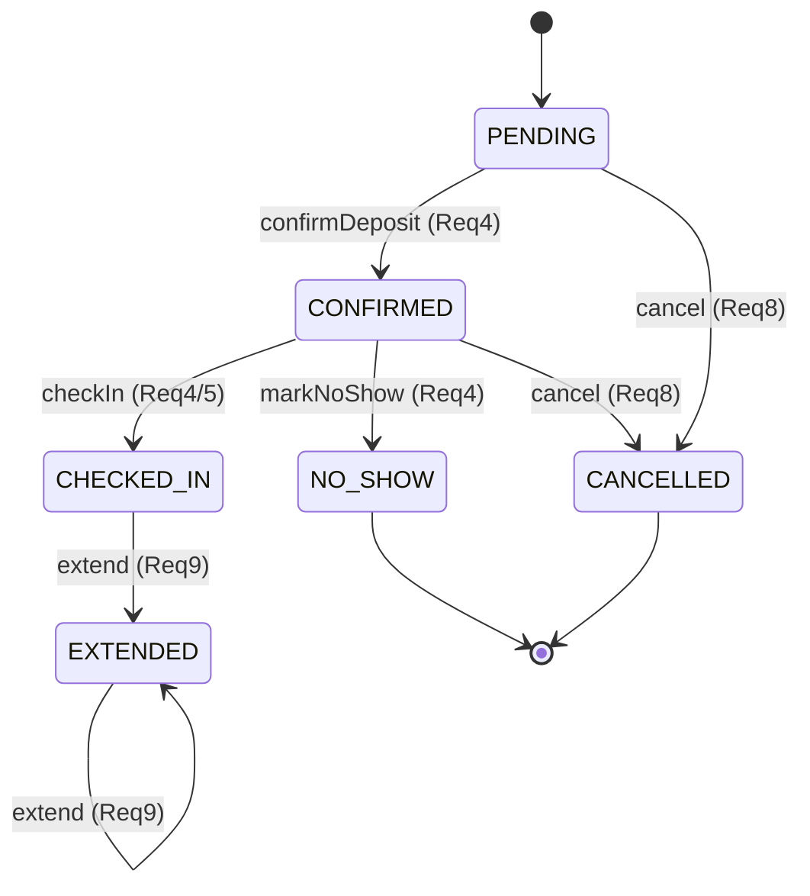
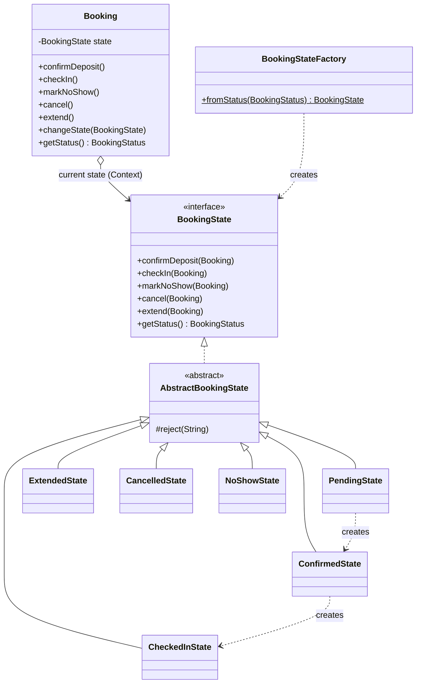

# State Design Pattern — Booking Lifecycle

**Owner:** Jasveer
**Requirements covered:** Req3 (book room), Req4 (upfront deposit / 30-min check-in / no-show), Req5 (check-in via sensors), Req8 (cancel/edit before start), Req9 (extend before expiry)

---

## 1. Justification — why State?

A `Booking` behaves **differently depending on where it is in its lifecycle**:

- A *pending* booking can be confirmed (deposit paid) or cancelled.
- A *confirmed* booking can be checked in, marked no-show, or cancelled — but it can no longer go back to pending.
- A *checked-in* booking can be extended, but it can **no longer** be cancelled (Req8 only allows cancellation *before* the start time).
- *Cancelled* and *no-show* are terminal — nothing further can happen.

Without a pattern, this logic becomes a tangle of `if (status == CONFIRMED && ...) else if (status == PENDING && ...)` scattered across every method that touches a booking. Every new rule multiplies the conditionals, and an illegal move (e.g. checking in a cancelled booking) can slip through silently.

The **State pattern** puts the rules *for one lifecycle stage* into *one class*. Each state class knows only which actions are legal from that stage and what the next stage is. `Booking` (the **Context**) stops deciding anything — it just forwards each action to its current state object. Adding a new stage or rule means adding/editing one small class, not editing a giant switch. Illegal transitions fail loudly with `IllegalBookingTransitionException` because the default behaviour of every action is "reject."

**Alternatives considered:** a plain `enum` + `switch` (what the codebase had before) — rejected because the transition rules leak into callers and illegal moves aren't enforced in one place. The `enum` is *kept*, but only as the serialization/notification vocabulary (see §4), not as the decision logic.

---

## 2. The state machine

| From state    | Action           | To state      | Req  |
|---------------|------------------|---------------|------|
| PENDING       | confirmDeposit   | CONFIRMED     | Req4 |
| PENDING       | cancel           | CANCELLED     | Req8 |
| CONFIRMED     | checkIn          | CHECKED_IN    | Req4/Req5 |
| CONFIRMED     | markNoShow       | NO_SHOW       | Req4 |
| CONFIRMED     | cancel           | CANCELLED     | Req8 |
| CHECKED_IN    | extend           | EXTENDED      | Req9 |
| EXTENDED      | extend           | EXTENDED      | Req9 |
| CANCELLED     | *(any)*          | ✗ rejected    | —    |
| NO_SHOW       | *(any)*          | ✗ rejected    | —    |

Any action not listed for a state is rejected by `AbstractBookingState` with a clear message.



---

## 3. Class diagram (State pattern sub-diagram)



**Roles:** `Booking` = Context · `BookingState` = State interface · `AbstractBookingState` = default "reject" behaviour · the six concrete states = Concrete States · `BookingStateFactory` rebuilds a state from a persisted status.

---

## 4. Integration with the other patterns

- **Observer (Taz):** `Booking.changeState()` is the single point where every transition ends by calling `notifyObservers(oldStatus, newStatus)`. Each state maps to one `BookingStatus` enum value via `getStatus()`, so the shared enum stays the single source of truth. Observer code is unchanged — it still reads a `BookingStatus`, it just no longer cares that a State object produced it. (Verified: `ObserverPatternDemo` runs unchanged against the refactored `Booking`.)
- **Persistence (CSV):** `setStatus(BookingStatus)` is kept as a compatibility/restore path — `BookingStateFactory.fromStatus()` rebuilds the correct state object when a booking is loaded from `bookings.csv`.
- **Strategy (Hasita, payment) / Command (Tara) / Factory (Shayan) / Facade (Martin):** a Command such as *ConfirmBooking* calls the semantic action `booking.confirmDeposit()`; the payment Strategy is invoked by the payment observer on the resulting transition.

---

## 5. Files

| File | Role |
|------|------|
| `BookingState.java` | State interface |
| `AbstractBookingState.java` | Default reject-all base |
| `PendingState / ConfirmedState / CheckedInState / ExtendedState / CancelledState / NoShowState` | Concrete states |
| `BookingStateFactory.java` | Status → State (for CSV restore) |
| `IllegalBookingTransitionException.java` | Raised on illegal transitions |
| `../Classes/Booking.java` | Context (delegates to current state) |
| `../Demo/StatePatternDemo.java` | Runnable demonstration |

**Run the demo:**
```
javac -cp lib/javacsv.jar -d bin $(find . -name '*.java')
java  -cp bin:lib/javacsv.jar Chief_event_coordinator.Demo.StatePatternDemo
```
